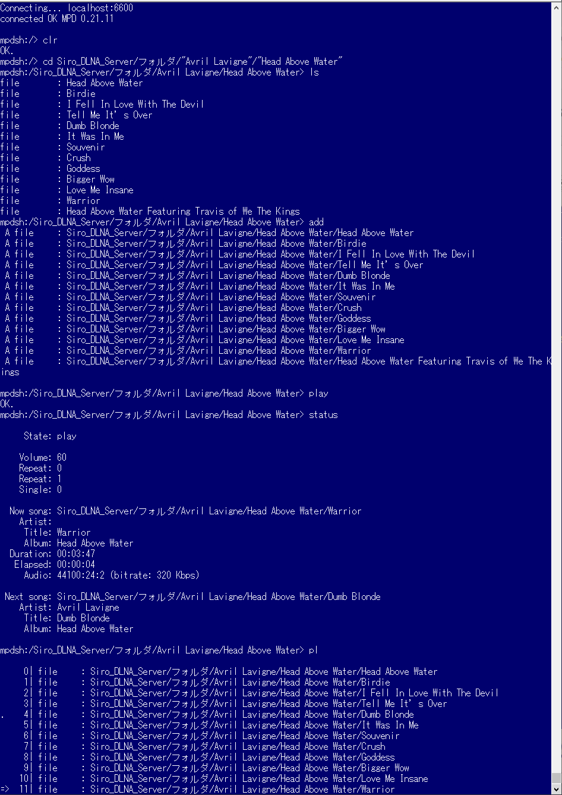

# mpdsh

[](https://crates.io/crates/mpdsh)
[](https://github.com/GiorgiBeriashvili/cli-timer#License "Project's LICENSE section")

## Description

Shell-like MPD ( Music Player Daemon ) client written in Rust.

https://www.musicpd.org/

This is a simple CLI application.
You can easily control MPD by using commands such as ls and cd.
Also, rustyline completion will help you enter the names of directories and files.

https://crates.io/crates/rustyline

## Exsample



## Usage

```
Usage: mpdsh [options]

Options:
    -h, --host localhost
                        MPD host address
    -p, --port 6600     MPD port number
    -d, --protolog      Output protocol log to stderr.
    -v, --version       Print version info and exit.
        --help          Print this help menu.
```

## Command

- **`help`**
	- show command list

- **`cd [<DIR>]`**
	- change directory
	- You can use the <TAB> key for completion.

- **`ls [-l] [<DIR|FILE>]`**
	- list file or directory
	- [-l] more info ( file only )
	- You can use the <TAB> key for completion.

- **`pl [-l]`**
	- show playlist
	- [-l] more info
	- FLG `=>` The current song stopped on or playing.
	- FLG `.`  The next song to be played.
	- alias( plist )

- **`add [<FILE|DIR>]`**
	- Adds the file to the playlist (directories add recursively).
	- If no file is specified, all files under the current directory are targeted.
	- You can use the <TAB> key for completion.
	- alias( a )


- **`add_top [<FILE|DIR>]`**
	- Adds the file to the playlist top (directories add recursively).
	- You can use the <TAB> key for completion.
	- alias( at )

- **`add_uri <URI> [<POSITION>]`**
	- Adds the file to the playlist.
	- URL of Internet radio, etc.

- **`del <POS>|<START:END>`**
	- Deletes a song from the playlist.

- **`clr`**
	- Deletes all songs from the playlist.

- **`move <POS>|<START:END> <TOPOS>`**
	- Moves the song in the playlist.

- **`play [<POS>]`**
	- Begins playing the playlist.
	- alias( p )

- **`stop`**
	- Stops playing.
	- alias( s )

- **`pause`**
	- Toggles pause playing.
	- alias( u )

- **`resume`**
	- Toggles resumes playing.
	- alias( u )

- **`prev`**
	- Plays previous song in the playlist.
	- alias( r )

- **`next`**
	- Plays next song in the playlist.
	- alias( n )

- **`random [<STATE>]`**
	- Sets random state to STATE, STATE should be 0 or 1.
	- Or display the current value

- **`repeat [<STATE>]`**
	- Sets repeat state to STATE, STATE should be 0 or 1.
	- Or display the current value.

- **`single <STATE>`**
	- Sets single state to STATE, STATE should be 0, 1 or `oneshot`
	- When single is activated, playback is stopped after current song, or song is repeated if the ‘repeat’ mode is enabled.
	- Or display the current value.

- **`volume <VOL>`**
	- Sets volume to VOL, the range of volume is 0-100.
	- Or display the current value.
	- alias( v )

- **`status`**
	- Reports the current status of the player and the volume level.
	- alias( st )

- **`update`**
	- Updates the music database on MPD

- **`cmd <MPDCOMMAND> [<MPDCOMMAND_ARG> ...]`**
	- Exec MPD Protocol command (see:https://www.musicpd.org/doc/html/protocol.html)

- **`quit`**
	- Quit this program.
	- alias( q )

## Actions

- **`<TAB>` key**
	- Filename completion

- **`<UP>` `<DOWN>` key**
	- History search

## Building

```sh
git clone https://github.com/zuntan/mpdsh.git
cd mpdsh
cargo build
cargo run -- -h
```

## License

mpdsh is licensed under either of the following, at your option:

* Apache License, Version 2.0 ([LICENSE-APACHE](https://github.com/GiorgiBeriashvili/cli-timer/blob/master/LICENSE-APACHE "Copy of the Apache license (version 2.0)"))
* MIT License ([LICENSE-MIT](https://github.com/GiorgiBeriashvili/cli-timer/blob/master/LICENSE-MIT "Copy of the MIT license"))

